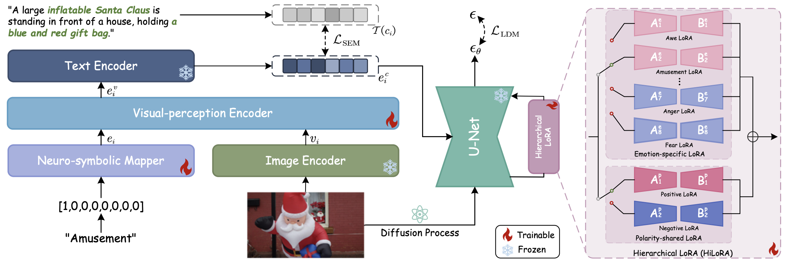

I'm Yuting Zhang, a second-year PhD student at the Hong Kong University of Science and Technology (Guangzhou), under the supervision of [Prof. Kaishun Wu](https://scholar.google.com/citations?user=Vt-q3E4AAAAJ&hl=zh-CN) and [Prof. Jintai Chen](https://scholar.google.com/citations?user=ZiY3xYEAAAAJ&hl=zh-CN&oi=ao). Prior to this, I earned my Bachelor's and Master's degrees in Communication Engineering from Tianjin University in 2021 and 2024, respectively. My research interests include multimodal large language models and AI for healthcare. 

News
======
- [2026.2] One paper about Medical Reasoning and Diagnosis is accepted by CVPR 2026. Denver, I’m coming! 🤸‍♀️
- [2026.1] One paper about EICG is accepted by ICLR 2026. 🎉
- [2025.6] One paper about rPPG is accepted by ICCV 2025. 🎉
- [2025.5] One paper about rPPG is accepted by IEEE TIP 2025. 🎊
- [2025.2] One paper about MLLM is accepted by CVPR 2025. 🥹
- [2024.9] I've enrolled at the Hong Kong University of Science and Technology (Guangzhou)!😁

Selected Publications
======

    
    

        <strong>MedTVT-R1: A Multimodal LLM Empowering Medical Reasoning and Diagnosis</strong> 
        <em><strong>Yuting Zhang*</strong>, Kaishen Yuan*, Hao Lu, Yutao Yue, Jintai Chen, Kaishun Wu</em> 
        <em>Computer Vision and Pattern Recognition (CVPR) 2026</em> 
        <a href="https://arxiv.org/pdf/2506.18512">Paper</a> | <a href="https://github.com/keke-nice/MedTVT-R1">Code</a>
    

    
    

        <strong>CoEmoGen: Towards Semantically-Coherent and Scalable Emotional Image Content Generation</strong> 
        <em>Kaishen Yuan*, <strong>Yuting Zhang*</strong>, Shang Gao, Yijie Zhu, Wenshuo Chen, Yutao Yue</em> 
        <em>International Conference on Learning Representations (ICLR) 2026</em> 
        <a href="https://arxiv.org/abs/2508.03535">Paper</a> | <a href="https://github.com/yuankaishen2001/CoEmoGen">Code</a>
    

    
    

        <strong>RhythmGuassian: Repurposing Generalizable Gaussian Model For Remote Physiological Measurement</strong> 
        <em>Hao Lu*, <strong>Yuting Zhang*</strong>, Jiaqi Tang, Bowen Fu, Wenhang Ge, Wei Wei, Kaishun Wu, Yingcong Chen</em> 
        <em>International Conference on Computer Vision (ICCV) 2025</em> 
        <a href="https://arxiv.org/pdf/2506.18512">Paper</a> | <a href="https://github.com/keke-nice/MedTVT-R1">Code</a>
    

    
    

        <strong>Period-LLM: Extending the Periodic Capability of Multimodal Large Language Model</strong> 
        <em><strong>Yuting Zhang*</strong>, Hao LU*, Qingyong Hu, Yin Wang, Kaishen Yuan, Xin Liu, Kaishun Wu</em> 
        <em>Computer Vision and Pattern Recognition (CVPR) 2025</em> 
        <a href="https://openaccess.thecvf.com/content/CVPR2025/papers/Zhang_Period-LLM_Extending_the_Periodic_Capability_of_Multimodal_Large_Language_Model_CVPR_2025_paper.pdf">Paper</a> | <a href="https://github.com/keke-nice/Period-LLM">Code</a>
    

    
    

        <strong>Advancing Generalizable Remote Physiological Measurement through the Integration of Explicit and Implicit Prior Knowledge</strong> 
        <em><strong>Yuting Zhang</strong>, Hao Lu, Xin Liu, Yingcong Chen, Kaishun Wu</em> 
        <em>IEEE Transactions on Image Processing (TIP) 2025</em> 
        <a href="https://arxiv.org/pdf/2403.06947">Paper</a> | <a href="https://github.com/keke-nice/Greip">Code</a>
    

    
    

        <strong>rPPG-MAE: Self-supervised Pre-training with Masked Autoencoders for Remote Physiological Measurement</strong> 
        <em>Xin Liu*, <strong>Yuting Zhang*</strong>, Zitong Yu, Hao Lu, Huanjing Yue, Jingyu Yang</em> 
        <em>IEEE Transactions on Multimedia (TMM) 2024</em> 
        <a href="https://arxiv.org/pdf/2306.02301">Paper</a> | <a href="https://github.com/keke-nice/rPPG-MAE">Code</a>
    

